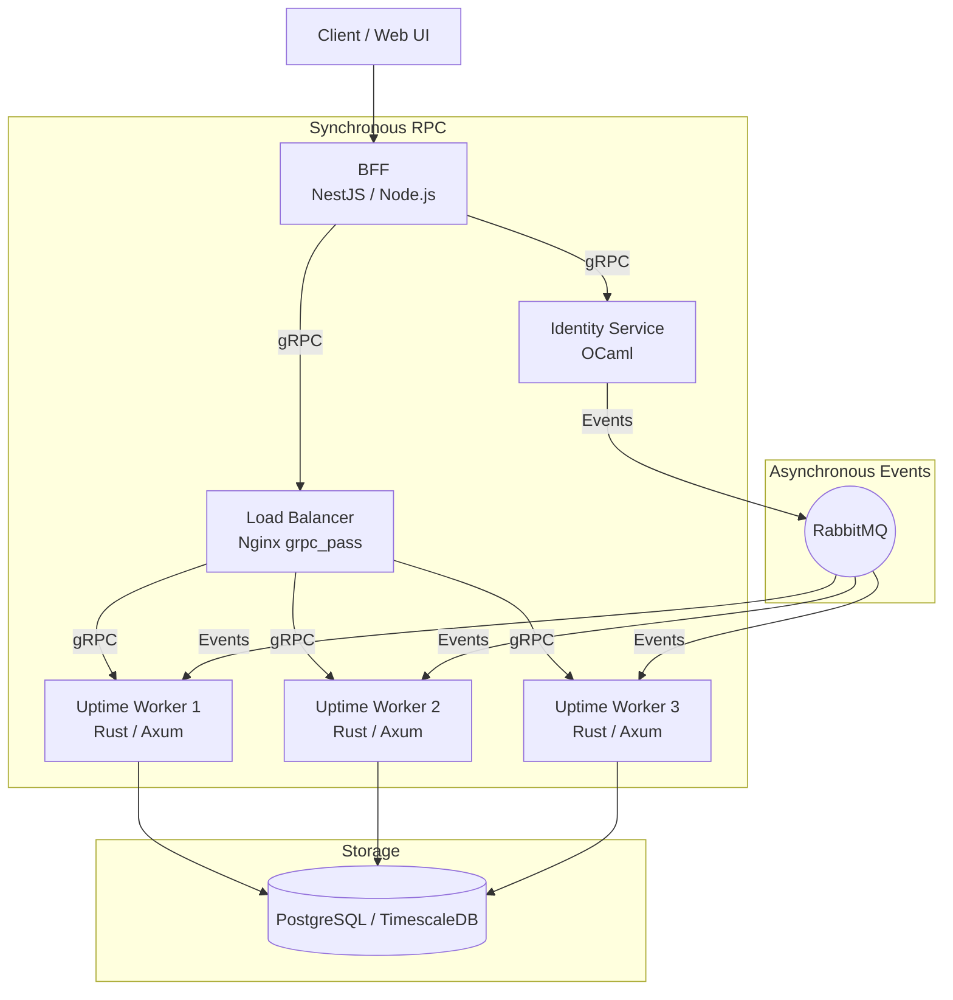

# Upward 🚀

> **Upward** — распределённая система мониторинга доступности сервисов (Uptime Monitoring) с микросервисной полиглот-архитектурой.

---

## 📐 Архитектура

Система построена на принципах разделения синхронных RPC-вызовов и асинхронной доставки событий:



### Компоненты системы

| Сервис | Стек | Роль и назначение |
| :--- | :--- | :--- |
| **`services/bff`** | **NestJS** (TypeScript / pnpm) | Backend-for-Frontend: точка входа для клиентов, агрегация данных, сессии/авторизация, проксирование в gRPC. |
| **`services/identity`** | **OCaml** (Dune) | Сервис идентификации, аутентификации и управления профилями пользователей. Эмитит доменные события в RabbitMQ. |
| **`services/uptime`** | **Rust** (Axum / Tokio) | Высокопроизводительный сервис чеков, пингов и сбора метрик доступности. Масштабируется горизонтально. |
| **Nginx** | **Reverse Proxy / LB** | L7 балансировка входящего gRPC-трафика (`grpc_pass`) между репликами Uptime сервиса. |
| **RabbitMQ** | **Message Broker** | Асинхронный обмен событиями (создание пользователя, изменение квот, алерты). |
| **PostgreSQL / TimescaleDB**| **Storage** | Хранение метаданных и таймсерий (истории пингов, метрик задержки и кодов ответа). |

---

## 🛠️ Стек окружения и монорепозиторий

Проект использует современные инструменты управления зависимостями и окружением:
- **[devenv.sh](https://devenv.sh)** / **Nix** — декларативное и изолированное окружение разработки (Rust, OCaml, Node.js, Moonrepo).
- **[direnv](https://direnv.net/)** — автоматическая активация переменных и путей при переходе в директорию проекта.
- **[Moonrepo (moon)](https://moonrepo.dev/)** — умный оркестратор задач и сборки монорепозитория.
- **pnpm** — управление пакетами JS/TS в воркспейсе.

---

## 🚀 Быстрый старт

### Требования
- Установленный [Nix](https://nixos.org/download.html)
- [direnv](https://direnv.net/) и [devenv](https://devenv.sh/)

### 1. Активация окружения

Склонируйте репозиторий и разрешите `direnv`:

```bash
git clone <repo-url> upward
cd upward
direnv allow
```

Либо войдите в шелл вручную:
```bash
devenv shell
```

При входе в шелл активируются все компиляторы и утилиты: `node`, `pnpm`, `cargo`, `ocaml`, `dune`, `moon`.

### 2. Установка зависимостей

```bash
pnpm install
```

---

## 📁 Структура проекта

```text
upward/
├── .moon/               # Конфигурация монорепозитория Moonrepo
├── services/
│   ├── bff/             # NestJS BFF приложение
│   ├── identity/        # OCaml сервис идентификации
│   └── uptime/          # Rust/Axum сервис мониторинга
├── devenv.nix           # Конфигурация окружения разработки (Nix/devenv)
├── pnpm-workspace.yaml  # Конфигурация JS воркспейсов
└── package.json
```

---

## 📜 Лицензия

Private / Proprietary
