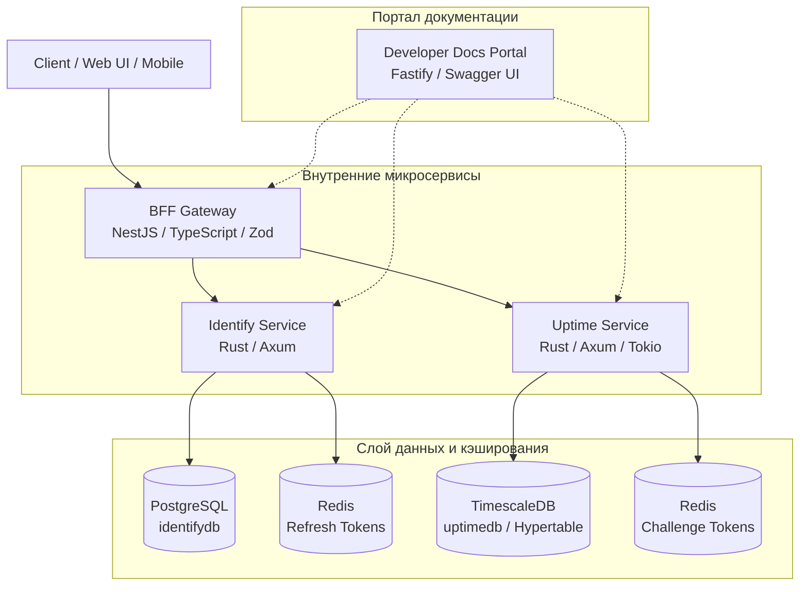

# Upward 🚀

> **Upward** — распределённая система мониторинга доступности сервисов (Uptime Monitoring) с микросервисной полиглот-архитектурой.

---

## 📐 Архитектура

Система построена на микросервисной архитектуре с разделением обязанностей: клиентский шлюз (BFF), ядро мониторинга (Uptime), сервис аутентификации (Identify) и портал документации (Docs).


```mermaid
flowchart TD
    Client[Client / Web UI / Mobile] --> BFF[BFF Gateway\nNestJS / TypeScript / Zod]
    
    subgraph Services [Внутренние микросервисы]
        BFF --> Identify[Identify Service\nRust / Axum]
        BFF --> Uptime[Uptime Service\nRust / Axum / Tokio]
    end

    subgraph Documentation [Портал документации]
        Docs[Developer Docs Portal\nFastify / Swagger UI]
        Docs -.-> BFF
        Docs -.-> Identify
        Docs -.-> Uptime
    end

    subgraph Storage [Слой данных и кэширования]
        Identify --> PG[(PostgreSQL\nidentifydb)]
        Identify --> RedisId[(Redis\nRefresh Tokens)]
        Uptime --> TS[(TimescaleDB\nuptimedb / Hypertable)]
        Uptime --> RedisUp[(Redis\nChallenge Tokens)]
    end
```

### Компоненты системы

| Сервис | Стек | Роль и назначение |
| :--- | :--- | :--- |
| **`services/bff`** | **NestJS** (TypeScript / pnpm / Zod / Orval) | Backend-for-Frontend: единый клиентский API-шлюз, аутентификация сессий, Google OAuth 2.0, проксирование и агрегация запросов. |
| **`services/identify`** | **Rust** (Axum / Tokio / SQLx / Argon2 / RS256) | Сервис идентификации и безопасности: регистрация, аутентификация, хеширование паролей Argon2id, выпуск RS256 JWT и ротация Refresh-токенов в Redis. |
| **`services/uptime`** | **Rust** (Axum / Tokio / SQLx / TimescaleDB / Redis) | Ядро мониторинга доступности: параллельный опрос сайтов (Tokio streams), HTTP-01 верификация, TimescaleDB гипертаблицы, валидация UI-виджетов. |
| **`services/docs`** | **Fastify** (TypeScript / Swagger UI) | Легковесный централизованный портал разработчика со встроенным Swagger UI для всех спецификаций микросервисов. |
| **PostgreSQL / TimescaleDB**| **Базы данных** | Хранение пользователей (`identifydb`) и временных рядов замеров доступности (`uptimedb`, автоматическое партиционирование и retention policy). |
| **Redis** | **In-memory кэш** | Хранение одноразовых токенов подтверждения сайтов (challenge tokens) и Refresh-токенов пользователей с автоматическим TTL. |

---

## ✨ Функциональные возможности (Фичи системы)

### 1. 🔍 Мониторинг доступности и сбор метрик (`services/uptime`)
- **Регистрация и валидация ресурсов:**
  - Добавление URL сайтов (`POST /sites`) для периодического мониторинга с валидацией протокола (`http`/`https` only) и очисткой чувствительных данных (запрет передачи credentials в строке URL).
  - Строгая валидация входящих DTO (ограничение длины URL до 2048 символов, идентификатора пользователя `user_id` до 128 символов).
- **Многоуровневая SSRF-защита (Zero-Trust к целевым хостам):**
  - Обязательный предварительный DNS-резолвинг доменного имени перед каждым запросом.
  - Фильтрация приватных подсетей (RFC 1918: `10.0.0.0/8`, `172.16.0.0/12`, `192.168.0.0/16`).
  - Фильтрация loopback (`127.0.0.0/8`), link-local (`169.254.0.0/16`), unspecified (`0.0.0.0`), broadcast, multicast (`224.0.0.0/4`), Carrier-grade NAT (`100.64.0.0/10`) и служебных сетей.
  - Фильтрация локальных и приватных адресов IPv6 (`::1`, `fc00::/7`, `fe80::/10`, IPv4-mapped IPv6).
  - Динамический черный список IP в базе данных (`forbidden_ip`) с моментальным запретом доступа к скомпрометированным хостам.
  - Защита от DNS Rebinding атак: принудительное связывание сетевого клиента с проверенными IP-адресами (`resolve_to_addrs`).
  - Переключаемый режим для локальной разработки через переменную окружения `ALLOW_PRIVATE_IPS`.
- **Протокол подтверждения владения ресурсом (HTTP-01 Challenge):**
  - Двухэтапная регистрация сайта: при создании ресурс получает статус `pending_verification` (`active = false`), исключая несанкционированный мониторинг чужих ресурсов.
  - Генерация одноразового криптографического токена проверки (`challenge_token`) с сохранением в Redis и настраиваемым временем жизни (TTL).
  - Проверка владения (`POST /sites/{site_id}/verify`): защищенный опрос эндпоинта `{target_url}/upward`, сверка challenge-токена и автоматическая активация ресурса.
  - Возможность перевыпуска challenge-токена для повторного подтверждения отключённого сайта (`POST /sites/{site_id}/challenge`).
- **Специализированный протокол `/upward` и кастомные UI-виджеты:**
  - Глубокий опрос целевого ресурса по эндпоинту `/upward` с получением расширенной телеметрии в формате JSON.
  - Поддержка настраиваемых дашборд-виджетов, валидируемых сервером по системному каталогу в таблице БД `widgets`:
    - `badge` — индикаторы статуса приложения (например, healthy/degraded);
    - `stat` — ключевые числовые метрики и тренды (RPS, количество ошибок);
    - `gauge` — круговые шкалы утилизации ресурсов (RAM %, CPU %);
    - `sparkline` — графики истории задержки (latency);
    - `key_value` — структурированная метаинформация о ноде (версия сервиса, регион, uptime);
    - `chart`, `row`, `column`, `text` — композиционные блоки для построения информационных панелей.
  - Строгая валидация структур: проверка обязательного поля `type`, формата данных и соответствия белому списку разрешенных виджетов.
- **Защита от сетевых аномалий и DoS (Payload & Stream Protection):**
  - Ограничение максимального размера ответа (по умолчанию 512 КБ): прерывание по заголовку `Content-Length` и потоковый контроль байт (`bytes_stream`) при `Transfer-Encoding: chunked`.
  - Жесткий таймаут сетевого соединения (10 секунд на сайт).
  - Запрет неконтролируемых редиректов (`Policy::none()`) для защиты от перенаправления во внутренний периметр.
- **Высокопроизводительный фоновый воркер опроса (Polling Worker):**
  - Асинхронный опрос на базе Tokio с интервальным таймером (`tokio::time::interval`).
  - Конкурентная обработка потока сайтов через Tokio Stream (`buffer_unordered`), настраиваемая через `PING_CONCURRENCY` (по умолчанию 25 одновременных запросов).
  - Пакетная выборка сайтов по лимиту `PING_BATCH_SIZE` (по умолчанию 500).
  - Автоматическая деактивация (`deactivate_site`) сайтов при сбое проверки (требуется повторная верификация владения).
- **Отказоустойчивая выборка задач (Distributed Locking / Multi-Worker Safe):**
  - Атомарный захват сайтов через CTE и `FOR UPDATE SKIP LOCKED`: гарантирует отсутствие конфликтов и дублирования работы между несколькими репликами сервиса без внешних распределенных блокировок.
  - Механизм самовосстановления (Dead Worker Recovery): автоматический возврат зависших в статусе `processing` сайтов в очередь через 3 минуты при аварийном падении воркера.
  - Автоматический возврат сайтов в статус `idle` и фиксация времени последней проверки (`last_check`).
- **Пакетная вставка результатов (Batch Insert):**
  - Сохранение сотен замеров одного раунда за один SQL-запрос через `QueryBuilder`, исключающее исчерпание пула соединений БД.
- **Хранение временных рядов в TimescaleDB:**
  - Гипертаблица `site_pings` с автоматическим партиционированием по времени (`create_hypertable`).
  - Автоматическая политика очистки устаревших данных (Data Retention Policy) старше 30 дней (`add_retention_policy`).
  - Хранение точного времени отклика (`duration_ms`), статусов и гибких JSONB-метаданных (`extra`).
- **REST API:**
  - `POST /sites` — добавление ресурса;
  - `GET /sites/{user_id}` — получение списка сайтов пользователя с метаданными последнего замера;
  - `POST /sites/{site_id}/verify` — подтверждение владения сайтом;
  - `POST /sites/{site_id}/challenge` — перевыпуск токена подтверждения;
  - `GET /sites/{site_id}/pings?user_id=...` — история замеров за 30 дней;
  - `GET /health` — Liveness/Readiness пробы;
  - Интерактивная документация Swagger UI по адресу `/docs`.

---

### 2. 🔐 Идентификация, аутентификация и безопасность (`services/identify`)
- **Управление пользователями:**
  - Регистрация учетных записей по email и паролю (`POST /register/password`).
  - Проверка уникальности email и валидация формата (длина до 320 символов).
  - Хеширование паролей криптографическим алгоритмом **Argon2id** со случайной солью (защита от атак по предвычисленным таблицам и GPU-подбора). Хеширование вынесено в тредпул `spawn_blocking` для разгрузки async runtime.
- **Двухфакторная модель токенов (RS256 JWT + Refresh Token Rotation):**
  - Аутентификация по логину/паролю (`POST /login/password`) с выдачей связки токенов:
    - **Access Token:** короткоживущий JWT (15 минут), подписанный асимметричным криптографическим алгоритмом **RS256** (RSA 2048-bit).
    - **Refresh Token:** одноразовый UUIDv4 токен с хранением в Redis и временем жизни 30 дней.
  - Безопасная ротация Refresh-токенов (`POST /refresh`): атомарное сжигание использованного токена через Redis `GETDEL` (защита от повторного использования и компрометации сессий) с выпуском новой пары токенов.
- **Децентрализованная верификация в микросервисах (Public Key Infrastructure):**
  - Эндпоинты раздачи публичного RSA-ключа: `GET /keys/public` (JSON) и `GET /keys/public.pem` (raw PEM).
  - Локальная проверка подписи JWT в других сервисах без сетевых round-trips к сервису идентификации.
- **Поддержка OAuth-провайдеров:**
  - Подготовка доменной модели к интеграции с внешними провайдерами авторизации (`Google`) и поддержка пользователей без локального пароля.
- **OpenAPI и Health Check:**
  - Автогенерация OpenAPI 3.0 через `utoipa`, Swagger UI на `/docs`, пробы на `/health`.

---

### 3. 🌐 Клиентский шлюз API Gateway / BFF (`services/bff`)
- **Единая точка входа для клиентов (Web / Mobile):**
  - Централизованный HTTP API шлюз на NestJS (порт 4000).
  - Агрегация и проксирование запросов к внутренним сервисам (`uptime`, `identify`).
  - Централизованный перехват и нормализация ошибок вышестоящих сервисов (`handleUpstreamError`) с маппингом HTTP-кодов.
- **Аутентификация и сессии:**
  - Регистрация (`POST /auth/register`), вход (`POST /auth/login`), ротация токенов (`POST /auth/refresh`).
  - Получение профиля текущего пользователя (`GET /auth/me`).
  - Авторизация маршрутов через `JwtAuthGuard` с локальной проверкой RS256 JWT:
    - Ленивая загрузка и кэширование открытого RSA-ключа в `KeyService`.
    - Извлечение данных пользователя (`@CurrentUser()`) и проброс токенов (`@RawToken()`).
- **Google OAuth 2.0 Авторизация:**
  - Вход через аккаунт Google (`GET /auth/google` и `GET /auth/google/callback`).
  - Использование стратегии `passport-google-oauth20` с извлечением ID, email, имени и аватара профиля.
- **Управление сайтами и мониторингом:**
  - Регистрация сайта (`POST /sites`) с автоматической привязкой к ID авторизованного пользователя.
  - Получение списка отслеживаемых ресурсов (`GET /sites`).
  - Запуск подтверждения владения сайтом (`POST /sites/:id/verify`).
  - Получение истории пингов и виджетов доступности (`GET /sites/:id/pings`).
- **Строгая типизация и валидация:**
  - Валидация входных данных через **Zod** (`ZodValidationPipe`, `nestjs-zod`).
  - Генерация строго типизированных клиентов через **Orval** на основе актуальных OpenAPI-спецификаций микросервисов.
- **OpenAPI документация:**
  - Документация Swagger UI по адресу `/docs` с поддержкой тестирования авторизованных запросов (Bearer Auth).

---

### 4. 📚 Портал документации разработчика (`services/docs`)
- **Единый хаб спецификаций:**
  - Легковесный микросервис на Fastify (порт 5000, запуск за 20 мс, расход памяти < 30 МБ).
  - Единый интерфейс Swagger UI с переключением спецификаций сервисов монорепозитория:
    - `BFF (Client Gateway)`
    - `Uptime (Monitoring Core)`
    - `Identify (Auth Service)`
- **Удобная навигация:**
  - Быстрые ссылки на схемы сервисов: `/bff`, `/uptime`, `/identify`.
  - Прямая раздача JSON-спецификаций: `/specs/bff.json`, `/specs/uptime.json`, `/specs/identify.json`.
- **Отказоустойчивость:**
  - Динамическое получение свежих схем с работающих микросервисов с автоматическим переключением на оффлайн-схемы при сбое.

---

### 5. ⚙️ Инфраструктура, DevOps и архитектурные решения
- **Монорепозиторий Moonrepo:**
  - Единая оркестрация задач (`moon run <project>:<task>`), умное кэширование артефактов и тестов.
- **Декларативное изолированное окружение (Nix / Devenv / Direnv):**
  - Автоматическая настройка всех необходимых инструментов (Rust toolchain, Node.js, pnpm, SQLx CLI, Moonrepo) без ручной установки.
- **Контейнеризация Docker Compose:**
  - Разделение на инфра-контейнеры (`compose.infra.yml`: TimescaleDB, PostgreSQL, Redis) и сервисные контейнеры (`compose.yml`).
  - Автоматическое применение миграций SQLx при старте контейнеров.
  - Изолированные docker-сети для сервисов и безопасное монтирование RSA-ключей в режиме `read_only`.
- **Безопасность сетевого периметра:**
  - Ограничение размера HTTP body до 16 KiB (`DefaultBodyLimit`).
  - Контроль CORS.
  - Изоляция пользователей и типобезопасные идентификаторы в Rust (`SiteId`, `UserId`, `AccessToken`).

---

---

## 🛠️ Стек окружения и монорепозиторий

Проект использует современные инструменты управления зависимостями и окружением:
- **[devenv.sh](https://devenv.sh)** / **Nix** — декларативное и изолированное окружение разработки (Rust, OCaml, Node.js, Moonrepo).
- **[direnv](https://direnv.net/)** — автоматическая активация переменных и путей при переходе в директорию проекта.
- **[Moonrepo (moon)](https://moonrepo.dev/)** — умный оркестратор задач и сборки монорепозитория.
- **pnpm** — управление пакетами JS/TS в воркспейсе.

---

## 🚀 Быстрый старт

### Требования
- Установленный [Nix](https://nixos.org/download.html)
- [direnv](https://direnv.net/) и [devenv](https://devenv.sh/)

### 1. Активация окружения

Склонируйте репозиторий и разрешите `direnv`:

```bash
git clone <repo-url> upward
cd upward
direnv allow
```

Либо войдите в шелл вручную:
```bash
devenv shell
```

При входе в шелл активируются все компиляторы и утилиты: `node`, `pnpm`, `cargo`, `moon`, `sqlx`.

### 2. Установка зависимостей

```bash
pnpm install
```

---

## 📁 Структура проекта

```text
upward/
├── .moon/               # Конфигурация монорепозитория Moonrepo
├── services/
│   ├── bff/             # NestJS клиентский API-шлюз
│   ├── identify/        # Rust/Axum сервис идентификации и аутентификации
│   ├── uptime/          # Rust/Axum/Tokio ядро мониторинга доступности
│   └── docs/            # Fastify портал документации со Swagger UI
├── devenv.nix           # Конфигурация окружения разработки (Nix/devenv)
├── pnpm-workspace.yaml  # Конфигурация JS воркспейсов
└── package.json
```

---

## 📜 Лицензия

Private / Proprietary
